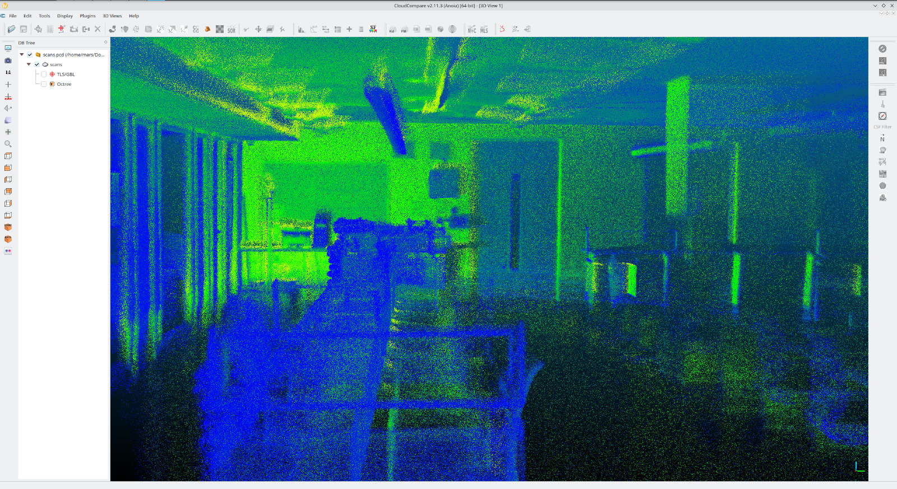

# Jetson Xavier NX LiDAR SLAM

Real-time 3D SLAM implementation using FAST-LIO and Livox Mid-360 LiDAR on a Jetson Xavier NX.

## Overview

This repository documents the successful implementation of FAST-LIO SLAM (Simultaneous Localization and Mapping) on a Jetson Xavier NX with a Livox Mid-360 LiDAR. The system performs both mapping and real-time localization, running entirely on the Jetson's onboard computing resources.

## Results

### Real-time Localization


### 3D Point Cloud Maps


## Hardware
- Jetson Xavier NX (Ubuntu 20.04)
- Livox Mid-360 LiDAR
- Quad steer drive wheeled mobile robot 

## Implementation

### System Setup
The implementation uses:
- ROS2 Humble
- FAST-LIO for SLAM
- Livox ROS Driver 2 for LiDAR interface

### Commands
To run the system:
```bash
# Terminal 1: Launch Livox driver
ros2 launch livox_ros_driver2 msg_MID360_launch.py

# Terminal 2: Launch FAST-LIO SLAM
ros2 launch fast_lio mapping.launch.py config_file:=mid360.yaml
